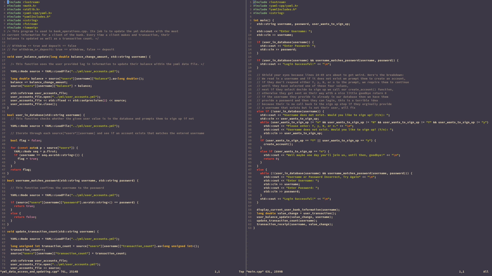
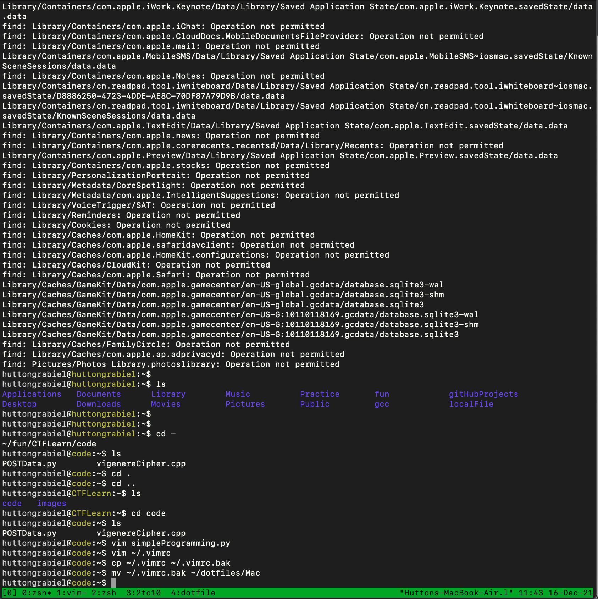
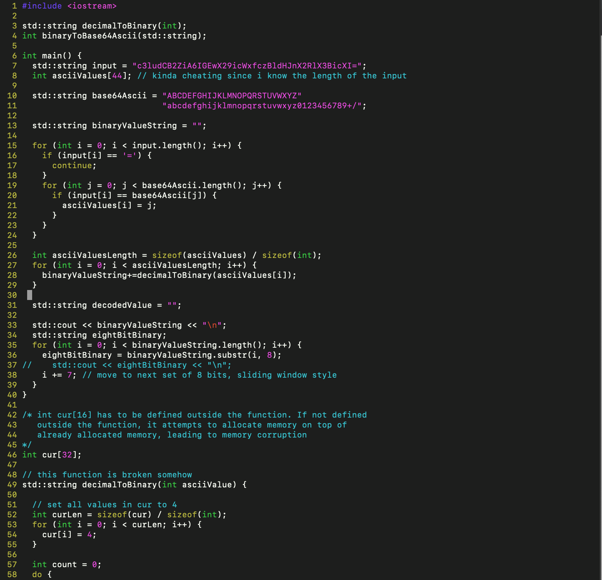
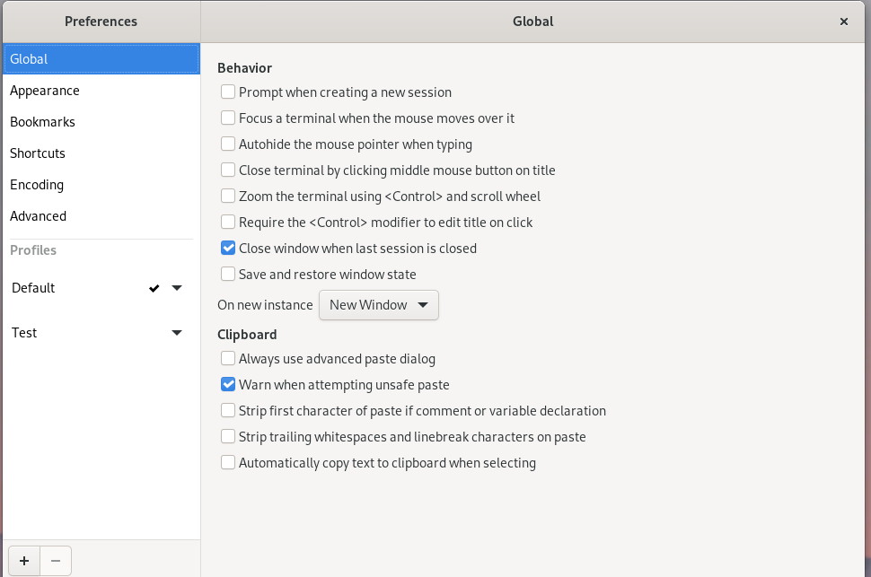
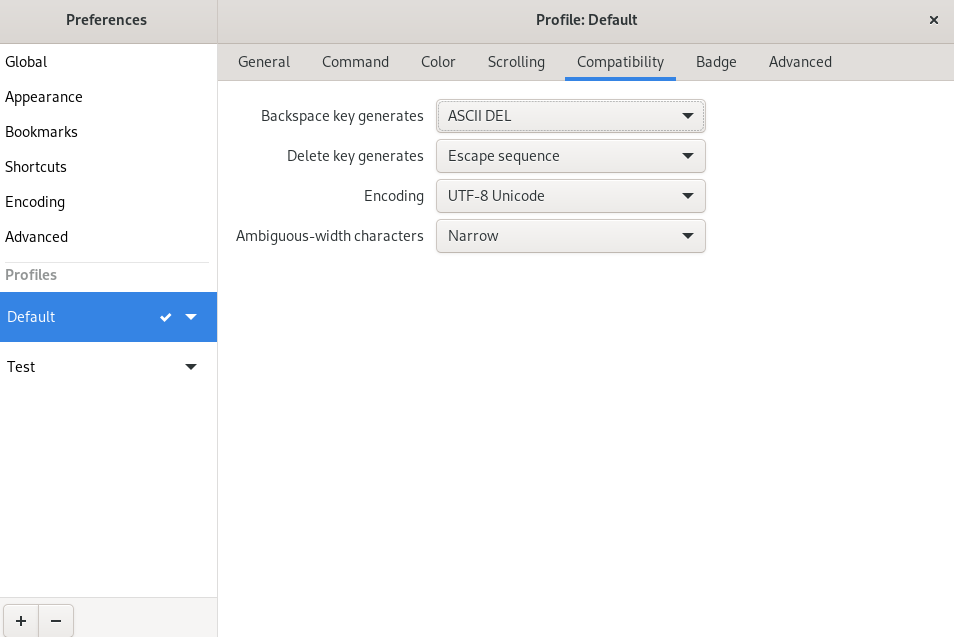
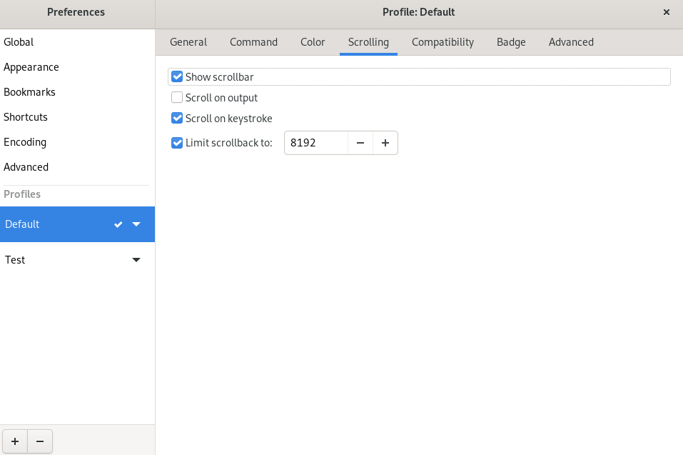
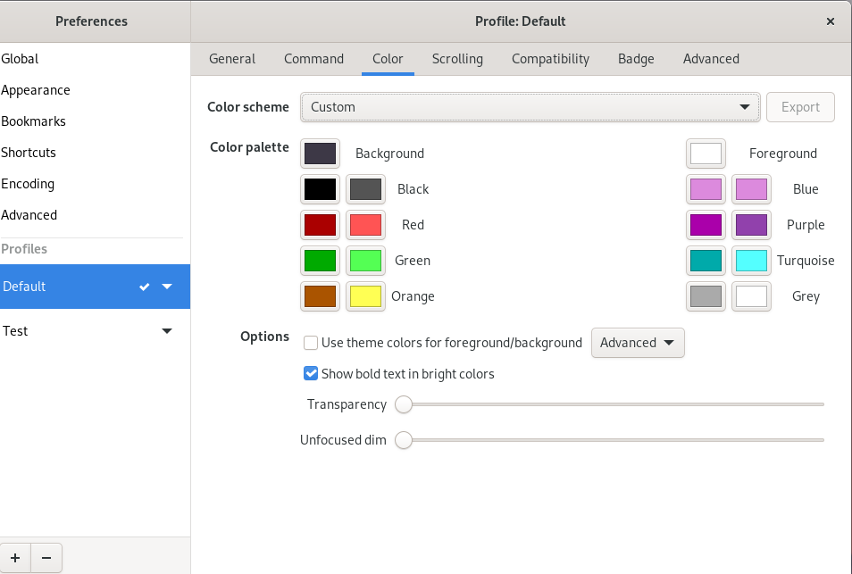
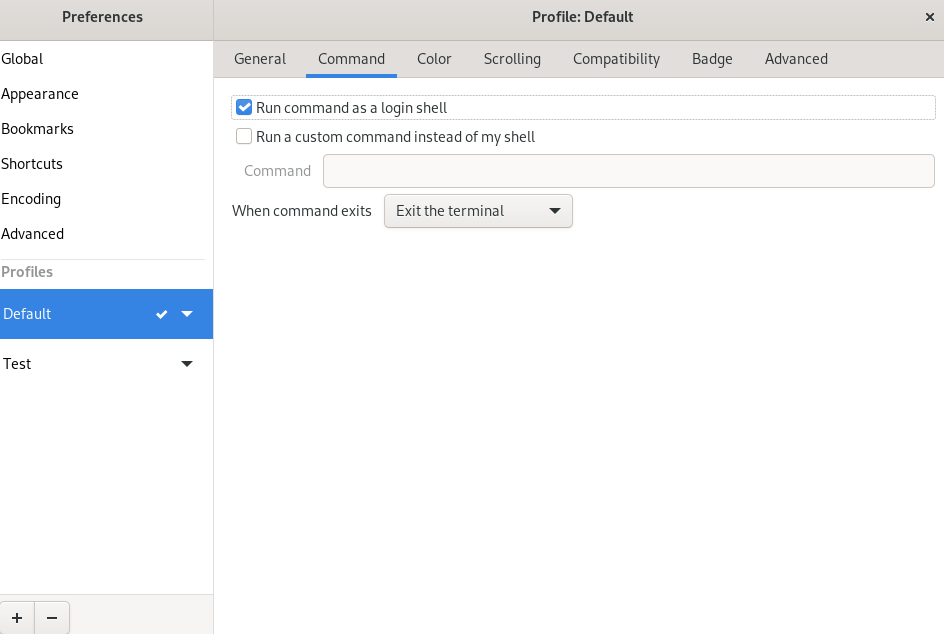
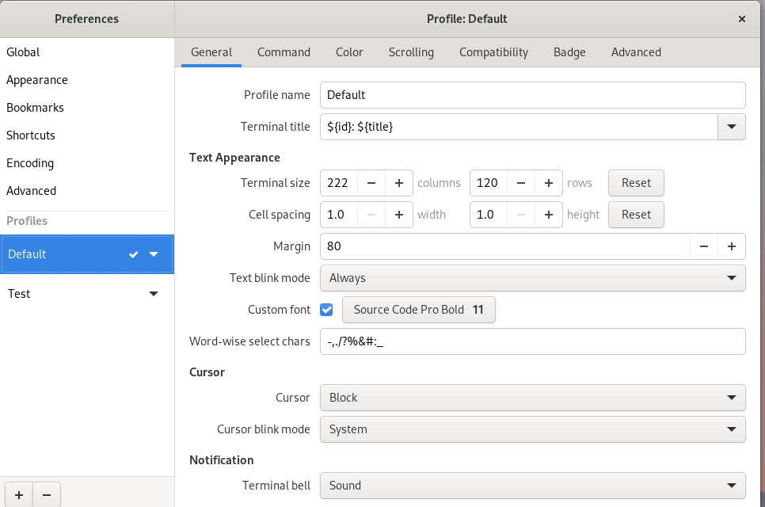
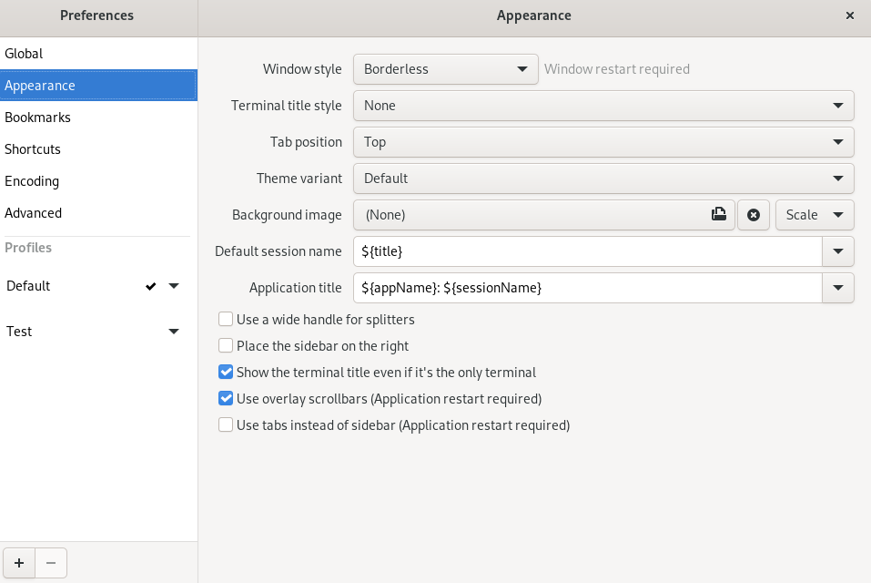

# Arch Linux
This is Arch Linux using Tilix Terminal Emulator

# Vim on Arch Linux
Colorscheme is gruvbox can be found on github morhetz/github

# MacOS
Using zsh shell with tmux

# Vim on Mac

# Screenshots of Arch Linux

